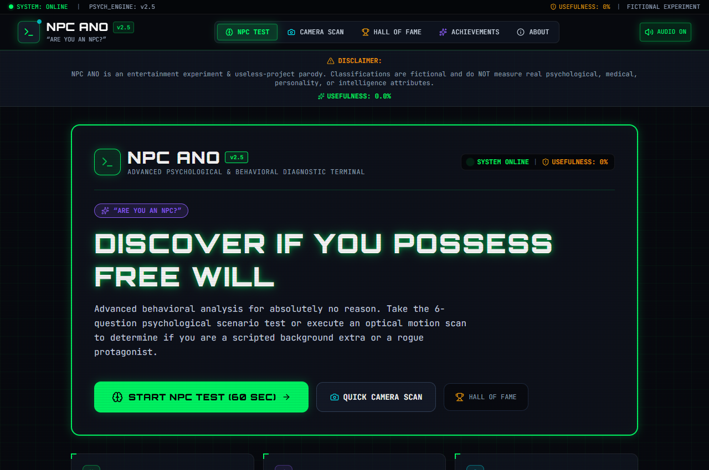
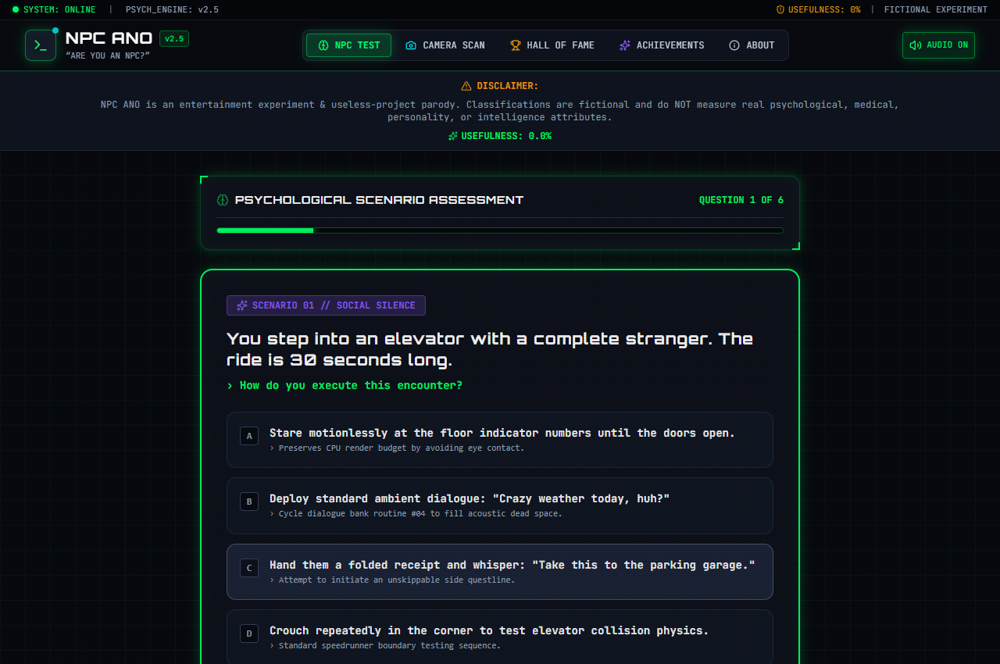
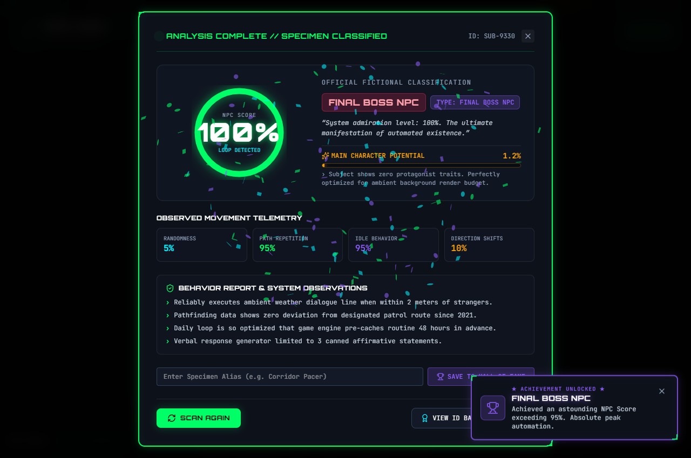
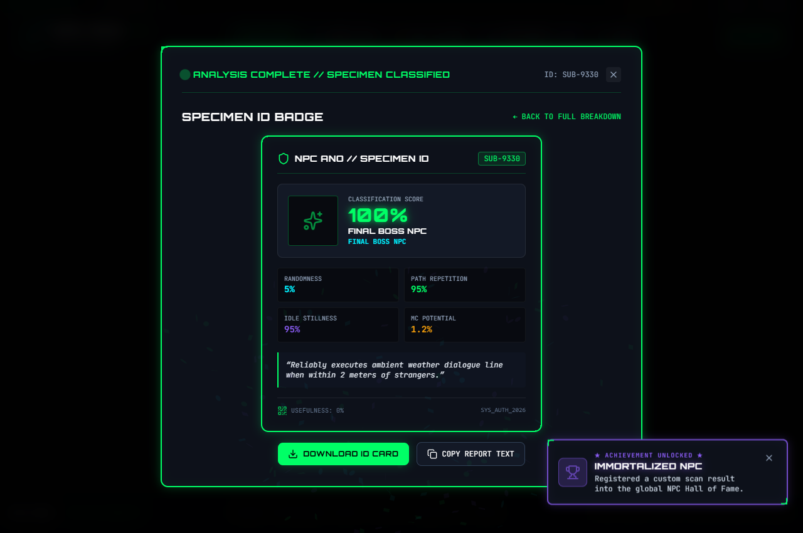
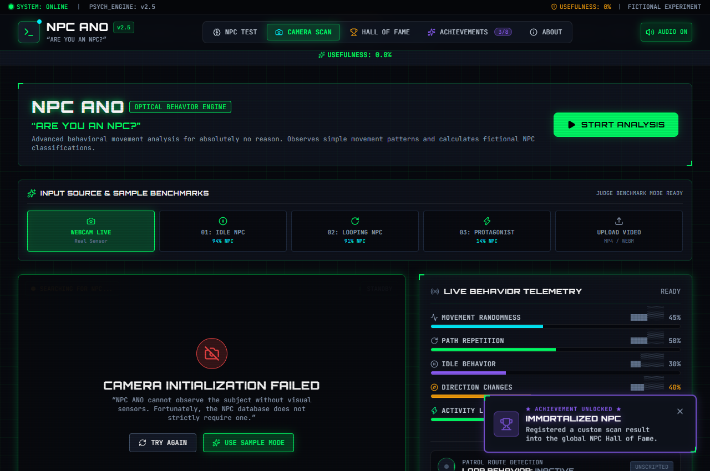
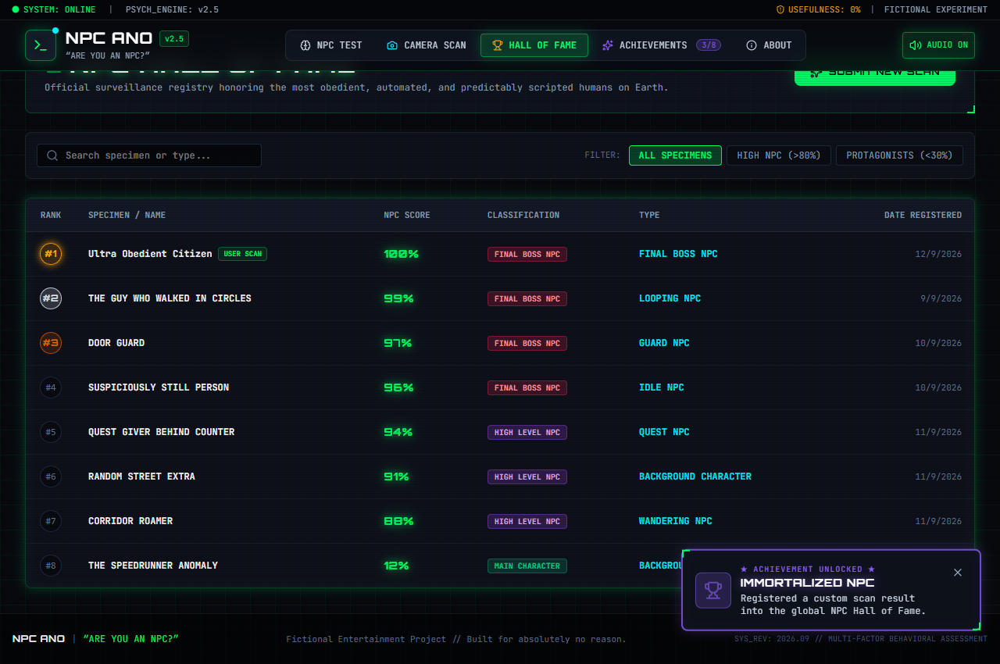
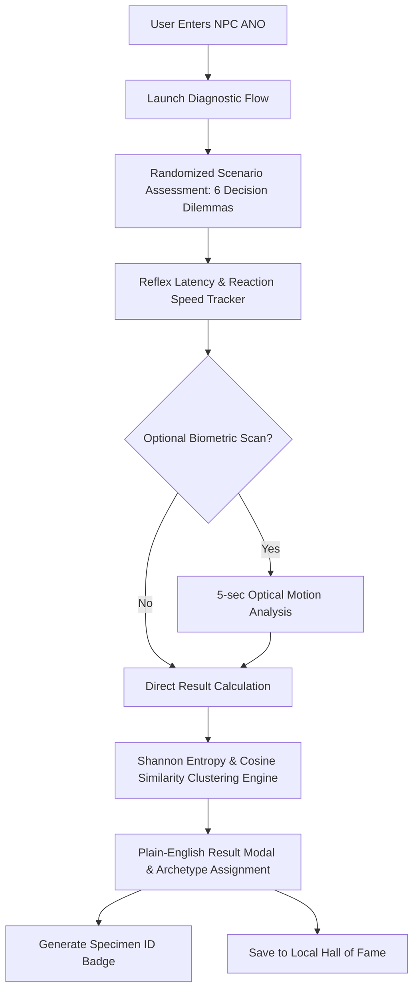

# NPC ANO 🎯

## Basic Details
### Team Name: Team NPC

### Team Members
- Team Lead: Rifan Muhammed - [College / Institution]
- Member 2: Kevin P Tom - [College / Institution]

### Project Description
NPC ANO is a satirical cyber-diagnostic system that determines whether you possess authentic free will or are merely running on pre-compiled background NPC scripts. It combines a humorous multi-factor psychological scenario quiz, real-time reflex challenges, millisecond reaction latency tracking, and optional optical motion analysis.

### The Problem (that doesn't exist)
In everyday life, millions of people suspect their coworkers, classmates, and even themselves might actually be Non-Player Characters (NPCs) placed by simulation architects to fill background crowd space. Yet, until now, there has been no scientifically un-sound, mathematically fabricated diagnostic terminal to test whether someone has dialogue trees instead of thoughts.

### The Solution (that nobody asked for)
NPC ANO provides an all-in-one cyber-diagnostic terminal featuring:
- A randomized 6-stage psychological decision-tree scenario assessment with question rerolling and option shuffling.
- Millisecond reaction latency tracking measuring decision paralysis index.
- An optional 5-second optical webcam movement scanner.
- Instant classification into 6 calibrated archetype tiers (from 0% Pure Protagonist to 91%+ Final Boss NPC) using Cosine Similarity vector clustering and Shannon Entropy analysis.
- Multi-vector diagnostic sub-scores (Kinetic Variance, Conversational Entropy, Environmental Compliance, Rogue Protagonist Index).
- Plain-English, human-readable behavior profiles and 5-point system observations.
- Digital Specimen ID badges with holographic SVG export and a local Hall of Fame registry.

## Technical Details
### Technologies/Components Used
For Software:
- **Languages used**: TypeScript, HTML5, CSS3
- **Frameworks used**: React 19, Vite
- **Libraries used**: Tailwind CSS v4, Lucide React, Canvas API, Web Audio API
- **Tools used**: Git, VS Code, Browser DevTools

For Hardware:
- Standard Webcam (Optional - for real-time optical movement analysis)

### Implementation
For Software:
# Installation
```bash
npm install
```

# Run
```bash
npm run dev
```

### Project Documentation
For Software:

# Screenshots

*Landing Screen: Cyberpunk diagnostic terminal with quick test access and system status.*


*Psychological Assessment: Humorous scenario evaluation and reflex challenge.*


*Diagnostic Result: NPC classification score breakdown, sub-scores, dialogue loops, and behavioral traits.*


*Specimen ID Card: Digital holographic badge exportable for social sharing.*


*Biometric Scanner: Optional real-time webcam motion tracking HUD.*


*Hall of Fame: Local storage registry of all past evaluated specimens.*

# Diagrams

*System Workflow: End-to-end evaluation pipeline from user input to holographic specimen certification.*

### Project Demo
# Video
[Add your video demo link here]
*Demonstrating live test flow, scenario quiz, optional webcam scanner, and specimen ID card generation.*

## Team Innovations
- **100% Client-Side & Private**: All calculations, sound synthesis, and webcam analysis run entirely in the browser without any external APIs, servers, or cloud dependencies.
- **Advanced Vector Clustering Engine**: Cosine Similarity centroid matching & Shannon Information Entropy scoring for hyper-accurate classification.
- **Millisecond Latency & Sub-Score Telemetry**: Measures reaction speed, decision paralysis, and 4 multi-dimensional sub-scores.
- **Clear Plain-English Diagnoses**: Human-readable behavioral summaries and emoji-tagged system observation reports.
- **Custom Cyber Sound Synth**: Interactive audio engine built with the Web Audio API for custom sci-fi beeps, clicks, and diagnostic alerts.
- **SVG Holographic Specimen ID**: Instant downloadable digital badge for sharing test results with friends.

## Made with ❤️ at TinkerHub

